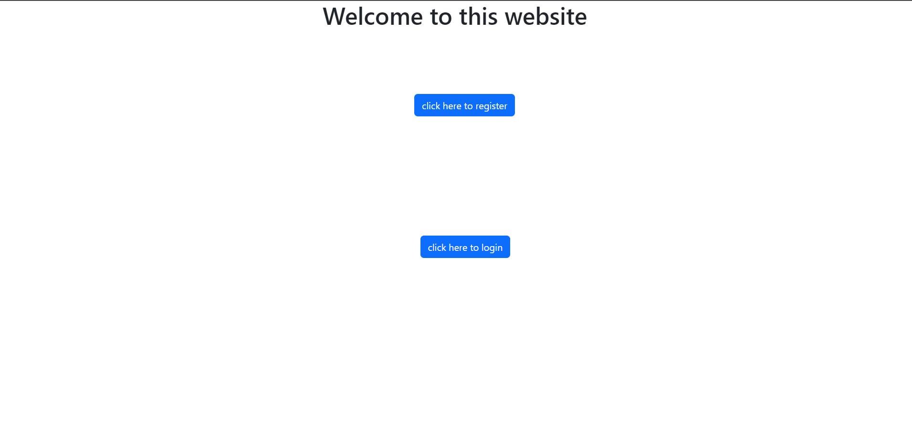

# LoginPageUsingNodejs
The login page is a simple, user-friendly webpage built using the latest web technologies, including Node.js, MongoDB, Express, and Angular. The registration process is straightforward and requires users to provide basic information such as their first name, last name, email ID, and password. Once registered, users can easily log in to the page with the credentials provided during registration. This login page serves as a testament to my self-learning journey and demonstrates my proficiency in these web technologies.
<h3>Demo run of The Project - </h3>

    
    

